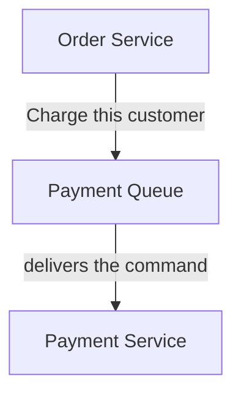
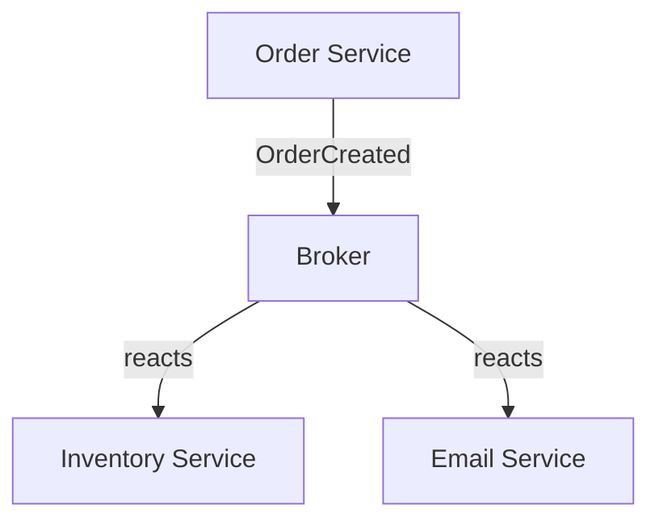
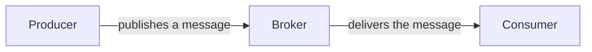

# Commands vs Events

The **message broker** (a tool) and the **architectural pattern** (how you use the tool) are two separate things. RabbitMQ, Kafka, SQS, NATS, they're all the same story here.

Think of the broker as the postal service. It doesn't decide what kind of communication you're doing. It just moves messages.

## Case 1 — sending a command (orchestration)



The Order Service is telling the Payment Service exactly what to do. That's a **command**.

## Case 2 — publishing an event (choreography)



The Order Service isn't asking anyone to do anything. It's announcing that something happened. Any service interested in that event can react. That's **choreography**.

## The broker itself gives you neither

Out of the box a broker only gives you this:



It has no idea whether the message means "charge the customer", "OrderCreated", or "hello world". That meaning is your application's decision, not the broker's. Swapping one broker for another doesn't change the pattern.

## What people mean by "Event-Driven Architecture"

They usually mean messages that describe something that **already happened**.

```
OrderCreated
PaymentSucceeded
UserRegistered
InvoiceGenerated
```

Other services subscribe and react on their own terms.

## Rule of thumb

Ask yourself one question.

> Am I telling another service what to do, or am I announcing something that happened?

- "Charge the customer." is a **command**, and usually points to orchestration.
- "CustomerCharged." is an **event**, and usually points to choreography.

That's the core distinction. Any broker can carry both kinds of message. The pattern lives in your intent, not in the tool.
